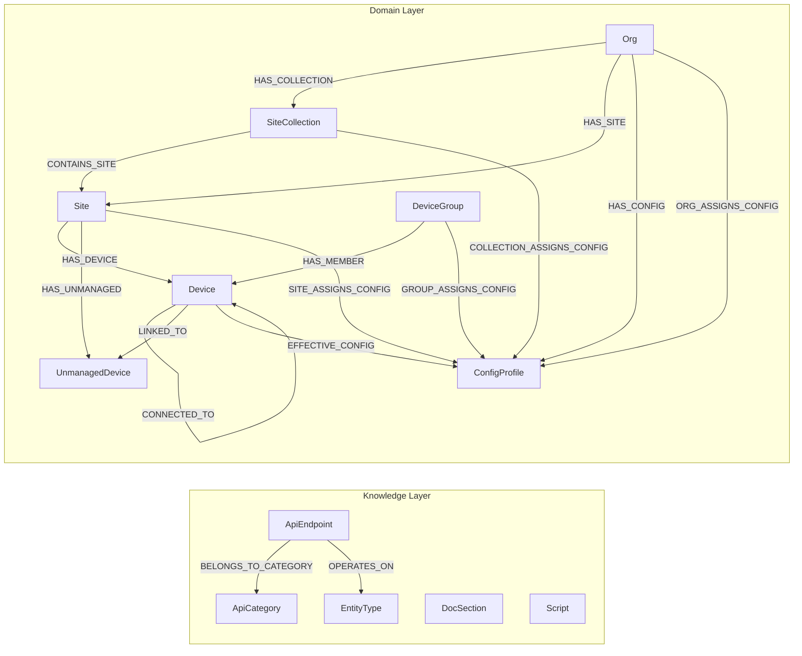
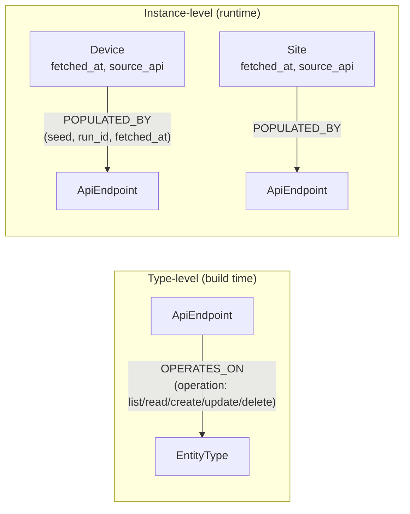
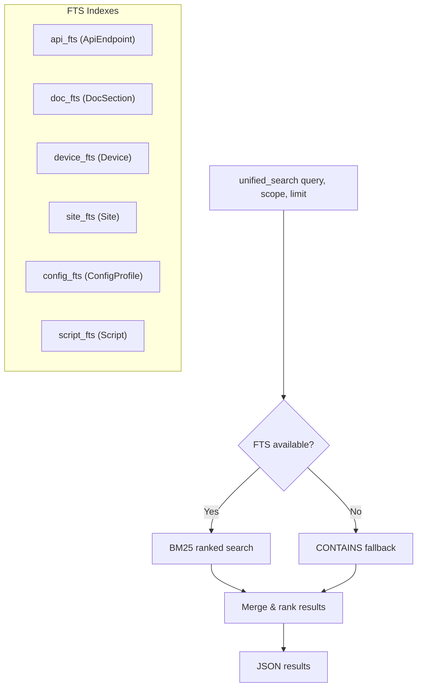

# HPE Networking Central MCP Server

MCP Server for **HPE Aruba Networking Central** and the **HPE GreenLake Platform**.

The agent manages network devices through a combination of direct API calls and reusable Python scripts, with full access to both the Central API and GreenLake Platform API.

## Architecture

```
┌─────────────────────────┐
│     MCP Client          │
│  (VS Code / Claude)     │
└──────────┬──────────────┘
           │ stdio (JSON-RPC)
┌──────────▼──────────────┐
│   MCP Server (FastMCP)  │
│                         │
│  Tools:                 │
│  ├─ call_central_api    │──► Central REST API (monitoring, config, etc.)
│  ├─ call_greenlake_api  │──► GreenLake Platform API (devices, subscriptions)
│  ├─ search_api_catalog  │──► Search unified catalog by keyword
│  ├─ list_api_categories │──► Browse all API categories with counts
│  ├─ get_api_endpoint_detail ──► Full parameter/schema detail for any endpoint
│  ├─ refresh_knowledge_db│──► Download latest knowledge DB from GitHub releases
│  ├─ query_graph         │──► Cypher queries against the configuration graph
│  ├─ refresh_graph       │──► Reset and re-run all seed scripts
│  ├─ list_scripts        │──► Browse automation script library
│  ├─ save_script         │──► Save Python scripts for reuse
│  ├─ get_script_content  │──► Read script source code
│  ├─ execute_script      │──► Run scripts (central_helpers SDK injected)
│  ├─ unified_search      │──► BM25 full-text search across APIs, docs, and data
│  ├─ search_related_apis │──► Find APIs by entity type and CRUD operation
│  └─ get_data_provenance │──► Trace any node back to its source API and seed
│                         │
│  Resources:             │
│  ├─ graph://schema      │──► Live schema introspection
│  ├─ docs://central/overview  │
│  ├─ docs://script-writing-guide │
│  ├─ docs://config-workflows │
│  └─ script://seeds      │
│                         │
│  Prompts:               │
│  ├─ analyze_inventory   │
│  ├─ analyze_config      │
│  ├─ troubleshoot_device │
│  └─ write_script        │
└─────────────────────────┘
```

## Knowledge Graph

The server maintains a LadybugDB (Kùzu) graph database with two layers:

1. **Knowledge layer** — API endpoints, categories, entity types, documentation, and scripts (populated at build time from OpenAPI specs)
2. **Domain layer** — live network state (devices, sites, config profiles) populated at runtime by seed scripts calling Central APIs

### Graph Schema



### Data Provenance

Every domain node tracks where its data came from. This lets an LLM answer
"which API populated this device?" or "what APIs can create a VLAN?"



**Type-level provenance** (OPERATES_ON edges) links each API endpoint to the entity
types it can read, create, update, or delete. The `operation` field is derived
from the HTTP method at build time.

**Instance-level provenance** records which specific API and seed script populated
each node at runtime, with timestamps and run IDs using `POPULATED_BY` edges and
`fetched_at`/`source_api` fields on the node itself.

### Search Architecture



Scopes filter which indexes/tables are searched: `all`, `api`, `docs`, `data`.

### Documentation Pipeline

The `DocSection` node table and `doc_fts` FTS index are defined in the schema
and ready for use, but **no doc scraping pipeline actively populates them yet**.
The existing scrapers (`oas_scraper.py`, `glp_spec_provider.py`) fetch OpenAPI
specs and populate `ApiEndpoint` nodes — they do not extract prose documentation.
A future iteration will add a doc chunking pipeline to populate `DocSection`
nodes from ReadMe.io or other documentation sources.

## Prerequisites

- Docker
- HPE Aruba Networking Central API credentials (client_id + client_secret)
- Optionally: HPE GreenLake Platform credentials (may share the same credentials)

## Quick Start

### VS Code MCP Configuration

Add to `.vscode/mcp.json`:

```json
{
  "servers": {
    "hpe-networking-central-mcp": {
      "command": "docker",
      "args": [
        "run", "-i", "--rm",
        "--pull", "always",
        "--env-file", "${workspaceFolder}/.env",
        "-v", "central-scripts:/scripts/library",
        "ghcr.io/tbelz/hpe-networking-central-mcp:main"
      ]
    }
  }
}
```

### Environment Variables (.env file)

```
CENTRAL_BASE_URL=https://internal.api.central.arubanetworks.com
CENTRAL_CLIENT_ID=your_client_id
CENTRAL_CLIENT_SECRET=your_client_secret
GREENLAKE_CLIENT_ID=your_glp_client_id
GREENLAKE_CLIENT_SECRET=your_glp_client_secret
```

| Variable | Required | Default | Description |
|----------|----------|---------|-------------|
| `CENTRAL_BASE_URL` | Yes | — | Central API base URL |
| `CENTRAL_CLIENT_ID` | Yes | — | OAuth2 client ID for Central |
| `CENTRAL_CLIENT_SECRET` | Yes | — | OAuth2 client secret for Central |
| `GREENLAKE_CLIENT_ID` | No | Central client ID | GreenLake Platform client ID |
| `GREENLAKE_CLIENT_SECRET` | No | Central client secret | GreenLake Platform client secret |
| `GLP_BASE_URL` | No | `https://global.api.greenlake.hpe.com` | GreenLake API base URL |
| `GLP_INCLUDED_SLUGS` | No | — | Comma-separated service slugs to include (or empty for default set) |

## Tools

| Tool | Description |
|------|-------------|
| `call_central_api` | Make authenticated requests to any Central API endpoint |
| `call_greenlake_api` | Make authenticated requests to any GreenLake Platform API endpoint |
| `search_api_catalog` | Search the unified API catalog for endpoints by keyword |
| `list_api_categories` | List all API categories with endpoint counts |
| `get_api_endpoint_detail` | Get full parameter and schema details for a specific endpoint |
| `refresh_knowledge_db` | Download the latest knowledge database from GitHub releases |
| `query_graph` | Execute read-only Cypher queries against the configuration graph |
| `refresh_graph` | Reset graph and re-run all auto-run seed scripts |
| `list_scripts` | List all scripts in the automation library |
| `get_script_content` | Read the source code of a script |
| `save_script` | Save a Python script to the library for reuse |
| `execute_script` | Execute a script with Central/GreenLake credentials injected |
| `unified_search` | BM25 full-text search across APIs, docs, and data nodes |
| `search_related_apis` | Find API endpoints by entity type and CRUD operation |
| `get_data_provenance` | Trace any data node back to its source API and seed script |

## Development

```bash
# Install uv
pip install uv

# Create venv and install dependencies
uv sync

# Run locally (without Docker)
uv run hpe-networking-central-mcp
```

### Building Locally

```bash
docker build -t hpe-networking-central-mcp .
```

## License

MIT
