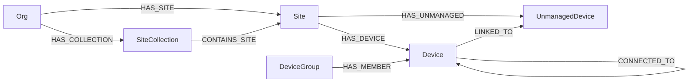
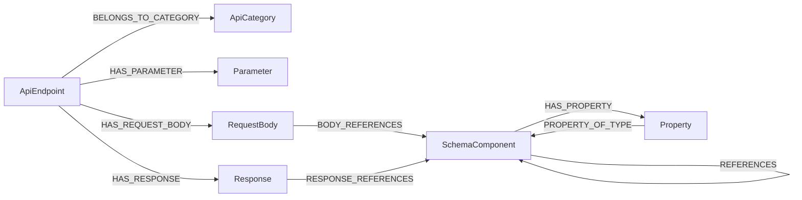

# HPE Networking Central MCP Server

[](https://github.com/tbelz/hpe-networking-central-mcp/actions/workflows/build-and-push.yml)
[](https://github.com/tbelz/hpe-networking-central-mcp/actions/workflows/update-knowledge-db.yml)
[](LICENSE)
[](https://python.org)

MCP Server for **HPE Aruba Networking Central** and the **HPE GreenLake Platform**.

The agent manages network devices through a combination of direct API calls and
reusable Python scripts, with full access to both the Central API and the
GreenLake Platform API. The OpenAPI surface of both platforms is decomposed
into a LadybugDB graph at build time, so `query_graph` (Cypher) is the primary
tool for endpoint and schema discovery — the agent walks `ApiEndpoint`,
`Parameter`, `RequestBody`, `Response`, `SchemaComponent`, and `Property`
nodes instead of paging through raw OpenAPI blobs.

## Architecture

```
┌─────────────────────────┐
│      MCP Client         │
│  (VS Code / Claude)     │
└──────────┬──────────────┘
           │ stdio (JSON-RPC)
┌──────────▼─────────────────────────────────────────────────────────────┐
│   MCP Server (FastMCP)                                                 │
│                                                                        │
│  Tools                                                                 │
│  ├─ list_api                       Category-grouped METHOD /path       │
│  ├─ describe_endpoint_for_device   Body / parameter guide for one      │
│  │                                  endpoint, device-aware             │
│  ├─ query_graph                    Cypher reads against LadybugDB      │
│  ├─ write_graph                    Cypher writes to enrich the graph   │
│  ├─ call_central_api               Central REST API (gated)            │
│  ├─ call_greenlake_api             GreenLake Platform API (gated)      │
│  ├─ list_scripts / get_script_content / save_script                    │
│  └─ execute_script                 Run scripts with central_helpers    │
│                                                                        │
│  Resources                                                             │
│  ├─ api://endpoint-catalog         Same catalog as list_api            │
│  ├─ docs://endpoint-catalog        Alias for clients filtering api://  │
│  ├─ graph://schema                 Live LadybugDB schema + Cypher      │
│  ├─ graph://seed-status            Startup seed execution results      │
│  ├─ docs://central/overview        Central + GreenLake API overview    │
│  ├─ docs://script-writing-guide    Script template + helpers ref       │
│  ├─ docs://config-workflows        Hierarchy / scope / effective cfg   │
│  ├─ docs://vsg/list, docs://vsg/{id}  Validated Solution Guide pages   │
│  └─ script://seeds                 Pre-built seed scripts metadata     │
│                                                                        │
│  Prompts                                                               │
│  └─ analyze_inventory · analyze_config · troubleshoot_device · write_script │
└────────────────────────────────────────────────────────────────────────┘
```

## Knowledge Graph (LadybugDB)

The server ships with a pre-built LadybugDB graph database that is updated
nightly by GitHub Actions and downloaded on first launch. It contains two
layers:

1. **Knowledge layer** — the entire OpenAPI surface of Central and GreenLake
   modelled as a structured subgraph: `ApiEndpoint`, `Parameter`,
   `RequestBody`, `Response`, `SchemaComponent`, `Property`, plus
   `ApiCategory`, `DocSection`, and `Script`. Populated at build time from
   the upstream OpenAPI specs.
2. **Domain layer** — live network state (`Org`, `SiteCollection`, `Site`,
   `Device`, `DeviceGroup`, `UnmanagedDevice`) populated at runtime by seed
   scripts that call the Central APIs.

### Domain layer



### API discovery subgraph (knowledge layer)



`Property` nodes carry the `x-supportedDeviceType` extension as a typed list
(`supportedDeviceTypes`) and the YANG mapping (`yangPath`) as first-class
properties, so a single Cypher query answers questions like *"which fields of
the NTP profile apply to Switch CX, and what is their YANG path?"*.

See [docs/adr/009-graph-as-primary-api-discovery.md](docs/adr/009-graph-as-primary-api-discovery.md)
for the rationale; the full canned-Cypher pattern set is embedded in
`graph://schema`.

## Prerequisites

- Docker (supports both **amd64** and **arm64** — Apple Silicon Macs pull the native image automatically)
- HPE Aruba Networking Central API credentials (client_id + client_secret)
- Optionally: HPE GreenLake Platform credentials (may share the same credentials)

## Quick Start

### VS Code MCP Configuration

Add to `.vscode/mcp.json`:

```json
{
  "servers": {
    "hpe-networking-central-mcp": {
      "command": "docker",
      "args": [
        "run", "-i", "--rm",
        "--pull", "always",
        "--env-file", "${workspaceFolder}/.env",
        "-v", "central-scripts:/scripts/library",
        "ghcr.io/tbelz/hpe-networking-central-mcp:main"
      ]
    }
  }
}
```

> **Tip — interactive credentials:** If you prefer entering credentials on each
> server start instead of storing them in a `.env` file, use VS Code input
> variables:
>
> ```json
> {
>   "inputs": [
>     { "id": "centralBaseUrl", "type": "promptString", "description": "Central API base URL" },
>     { "id": "centralClientId", "type": "promptString", "description": "Central Client ID" },
>     { "id": "centralClientSecret", "type": "promptString", "description": "Central Client Secret", "password": true }
>   ],
>   "servers": {
>     "hpe-networking-central-mcp": {
>       "command": "docker",
>       "args": [
>         "run", "-i", "--rm", "--pull", "always",
>         "-v", "central-scripts:/scripts/library",
>         "-e", "CENTRAL_BASE_URL=${input:centralBaseUrl}",
>         "-e", "CENTRAL_CLIENT_ID=${input:centralClientId}",
>         "-e", "CENTRAL_CLIENT_SECRET=${input:centralClientSecret}",
>         "ghcr.io/tbelz/hpe-networking-central-mcp:main"
>       ]
>     }
>   }
> }
> ```
>
> VS Code will prompt you for each credential when the server starts.
> GreenLake credentials can be added the same way if needed.

### Environment Variables (.env file)

```
CENTRAL_BASE_URL=https://apigw-YOUR_CLUSTER.central.arubanetworks.com
CENTRAL_CLIENT_ID=your_client_id
CENTRAL_CLIENT_SECRET=your_client_secret
GREENLAKE_CLIENT_ID=your_glp_client_id
GREENLAKE_CLIENT_SECRET=your_glp_client_secret
```

| Variable | Required | Default | Description |
|----------|----------|---------|-------------|
| `CENTRAL_BASE_URL` | Yes | — | Central API base URL ([find yours](https://developer.arubanetworks.com/aruba-central/docs/api-gateway-url)) |
| `CENTRAL_CLIENT_ID` | Yes | — | OAuth2 client ID for Central |
| `CENTRAL_CLIENT_SECRET` | Yes | — | OAuth2 client secret for Central |
| `GREENLAKE_CLIENT_ID` | No | Central client ID | GreenLake Platform client ID |
| `GREENLAKE_CLIENT_SECRET` | No | Central client secret | GreenLake Platform client secret |
| `GLP_BASE_URL` | No | `https://global.api.greenlake.hpe.com` | GreenLake API base URL |
| `GLP_INCLUDED_SLUGS` | No | — | Comma-separated service slugs to include (or empty for default set) |
| `READ_ONLY` | No | `false` | When set to `true` / `1` / `yes` / `on`, the server refuses any non-GET Central / GreenLake API call (both via tools and from inside scripts) and hides mutating endpoints from `list_api`. Local operations (`write_graph`, `save_script`, `execute_script`) remain available. |

### Startup behaviour

On first launch the server downloads the latest pre-built knowledge DB
tarball published by the
[`update-knowledge-db`](.github/workflows/update-knowledge-db.yml) workflow.
The on-disk manifest records the GitHub release tag, so subsequent launches
short-circuit the download when the local DB is already current — typical
warm-start latency is well under a second. If GitHub is unreachable but a
local DB exists, the server keeps using it (logged as
`knowledge_db_offline_using_local`) instead of falling back to an empty DB.

### Read-Only Mode

Start the container with `READ_ONLY=true` to lock the server into a
**network-side read-only** posture:

- `call_central_api` / `call_greenlake_api` reject `POST`, `PUT`, `PATCH`,
  and `DELETE` with a `READ_ONLY` error.
- The same restriction is enforced inside scripts — `api.post(...)` and
  friends fail with `CentralAPIError(403, "READ_ONLY", ...)`.
- Mutating endpoints are filtered out of `list_api` and the embedded API
  catalog so the model never sees them.
- A banner is prepended to the MCP system prompt so the assistant knows it
  must not attempt configuration changes.
- Local-only operations (graph writes, saving / editing scripts, executing
  scripts that only read) continue to work — useful for auditing and
  reporting workflows.

> **Scope of enforcement.** READ_ONLY is an *agent behavioural guardrail*,
> not a hard sandbox. Scripts run as subprocesses with the OAuth
> credentials available in their environment. Enforcement happens at the
> HTTP-client layer in two places: `BaseHTTPClient._request` (covers
> `central_helpers.api` / `glp`, the documented script API) and an
> `httpx.Client` / `httpx.AsyncClient` monkey-patch installed via a
> `sitecustomize` module that is added to the script subprocess
> `PYTHONPATH` only when READ_ONLY is active. A deliberately malicious
> script that uses `urllib`, `requests`, or raw sockets could still issue
> mutating calls — do not expose READ_ONLY mode to untrusted authors.

## Claude Desktop / Claude Code Configuration

Claude Desktop reads its MCP servers from
`%APPDATA%\Claude\claude_desktop_config.json` (Windows) or
`~/Library/Application Support/Claude/claude_desktop_config.json` (macOS).
Claude Code reads `~/.config/claude-code/config.json` and uses the same
schema.

Paste the snippet below into the `mcpServers` block, replace the five
placeholders, and restart the client. No `.env` file is needed — secrets
are passed inline via Docker `-e` flags. The included `*-readonly` entry
runs the same image with `READ_ONLY=true` for inspection-only sessions.

```json
{
  "mcpServers": {
    "hpe-networking-central-mcp": {
      "command": "docker",
      "args": [
        "run", "-i", "--rm", "--pull", "always",
        "-v", "central-scripts:/scripts/library",
        "-e", "CENTRAL_BASE_URL",
        "-e", "CENTRAL_CLIENT_ID",
        "-e", "CENTRAL_CLIENT_SECRET",
        "-e", "GREENLAKE_CLIENT_ID",
        "-e", "GREENLAKE_CLIENT_SECRET",
        "ghcr.io/tbelz/hpe-networking-central-mcp:main"
      ],
      "env": {
        "CENTRAL_BASE_URL": "https://apigw-YOUR_CLUSTER.central.arubanetworks.com",
        "CENTRAL_CLIENT_ID": "REPLACE_WITH_YOUR_CENTRAL_CLIENT_ID",
        "CENTRAL_CLIENT_SECRET": "REPLACE_WITH_YOUR_CENTRAL_CLIENT_SECRET",
        "GREENLAKE_CLIENT_ID": "REPLACE_WITH_YOUR_GLP_CLIENT_ID",
        "GREENLAKE_CLIENT_SECRET": "REPLACE_WITH_YOUR_GLP_CLIENT_SECRET"
      }
    },
    "hpe-networking-central-mcp-readonly": {
      "command": "docker",
      "args": [
        "run", "-i", "--rm", "--pull", "always",
        "-v", "central-scripts:/scripts/library",
        "-e", "CENTRAL_BASE_URL",
        "-e", "CENTRAL_CLIENT_ID",
        "-e", "CENTRAL_CLIENT_SECRET",
        "-e", "GREENLAKE_CLIENT_ID",
        "-e", "GREENLAKE_CLIENT_SECRET",
        "-e", "READ_ONLY",
        "ghcr.io/tbelz/hpe-networking-central-mcp:main"
      ],
      "env": {
        "CENTRAL_BASE_URL": "https://apigw-YOUR_CLUSTER.central.arubanetworks.com",
        "CENTRAL_CLIENT_ID": "REPLACE_WITH_YOUR_CENTRAL_CLIENT_ID",
        "CENTRAL_CLIENT_SECRET": "REPLACE_WITH_YOUR_CENTRAL_CLIENT_SECRET",
        "GREENLAKE_CLIENT_ID": "REPLACE_WITH_YOUR_GLP_CLIENT_ID",
        "GREENLAKE_CLIENT_SECRET": "REPLACE_WITH_YOUR_GLP_CLIENT_SECRET",
        "READ_ONLY": "true"
      }
    }
  }
}
```

The same `env` / `-e` pattern works for any other MCP client that supports
the standard `command` + `args` + `env` schema. Drop the second entry if you
don't need a read-only profile, or drop the `GREENLAKE_*` lines if you're
only using Central APIs.

## Tools

| Tool | Description |
|------|-------------|
| `list_api` | Category-grouped path-tree of every available `METHOD /path` for Central and GreenLake. Same content as the `api://endpoint-catalog` resource. |
| `describe_endpoint_for_device` | Field-by-field guide for one endpoint: parameters (path / query / header) plus every leaf property of the request body (or `200` response if no body), already flattened across `allOf` branches. Optional `deviceType` filter uses the `x-supportedDeviceType` extension. Recording an inspection here is what unlocks `call_central_api` for that endpoint. |
| `query_graph` | Read-only Cypher against the LadybugDB graph. Primary tool for cross-endpoint structural questions, hierarchy navigation, and `$ref` traversal. Soft cap 200 rows / hard cap 2000. Accepts a `parameters` JSON-string for parameterised queries. |
| `write_graph` | Cypher writes (`CREATE`, `MERGE`, `SET`, `DELETE`) to enrich the domain layer of the graph from runtime discoveries. |
| `call_central_api` | Make authenticated requests to any Central API endpoint. Gated on a prior `describe_endpoint_for_device` call (or an explicit `endpoint_id="METHOD:/path"` attestation) for the target endpoint in the same session. |
| `call_greenlake_api` | Same as `call_central_api`, against the GreenLake Platform API. Only registered when GreenLake credentials are configured. |
| `list_scripts` | List all scripts in the automation library, optionally filtered by tag. |
| `get_script_content` | Read the source code of a script. |
| `save_script` | Save a Python script to the library for reuse. |
| `execute_script` | Execute a script with Central / GreenLake credentials and the `central_helpers` SDK injected. |

The call gate is template-aware: inspecting
`/.../gateways/{serial-number}/dhcp-pools` authorises any concrete
instantiation such as `/.../gateways/DL0006948/dhcp-pools`. When a call is
blocked, the gate inlines the matched endpoint's property summary into the
error response, so the agent recovers in a single turn.

## Development

```bash
# Install uv
pip install uv

# Create venv and install dependencies
uv sync

# Run locally (without Docker)
uv run hpe-networking-central-mcp

# Run the test suite (no creds needed for unit tests; live_api is auto-skipped)
uv run pytest -m "unit and not slow"
uv run pytest                       # full suite (skips live_api without creds)
uv run pytest -m live_api           # requires .env with Central / GLP creds
```

See [docs/DEVELOPMENT.md](docs/DEVELOPMENT.md) for build pipeline details
and the test-marker reference, and the [docs/adr/](docs/adr/) directory
for architectural decisions.

### Building Locally

```bash
docker build -t hpe-networking-central-mcp .
```

## License

MIT
