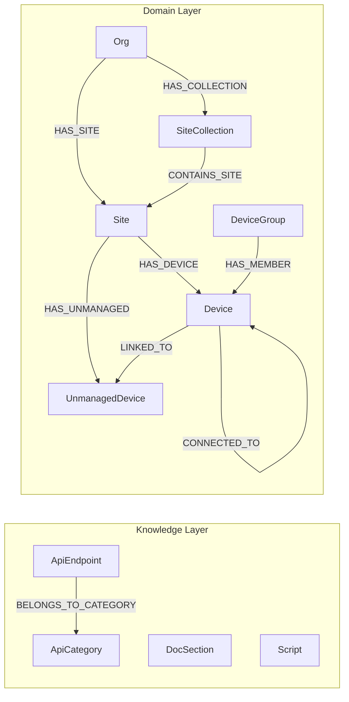
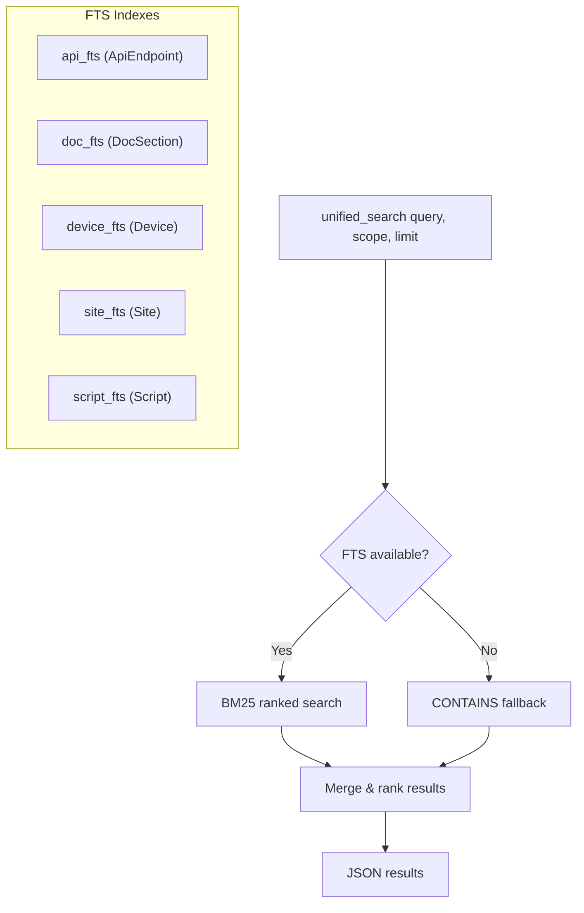

# HPE Networking Central MCP Server

[](https://github.com/tbelz/hpe-networking-central-mcp/actions/workflows/build-and-push.yml)
[](https://github.com/tbelz/hpe-networking-central-mcp/actions/workflows/update-knowledge-db.yml)
[](LICENSE)
[](https://python.org)

MCP Server for **HPE Aruba Networking Central** and the **HPE GreenLake Platform**.

The agent manages network devices through a combination of direct API calls and reusable Python scripts, with full access to both the Central API and GreenLake Platform API.

## Architecture

```
┌─────────────────────────┐
│     MCP Client          │
│  (VS Code / Claude)     │
└──────────┬──────────────┘
           │ stdio (JSON-RPC)
┌──────────▼──────────────┐
│   MCP Server (FastMCP)  │
│                         │
│  Tools:                 │
│  ├─ call_central_api    │──► Central REST API (monitoring, config, etc.)
│  ├─ call_greenlake_api  │──► GreenLake Platform API (devices, subscriptions)
│  ├─ unified_search      │──► Search APIs, docs, and data by keyword (BM25/FTS)
│  ├─ list_api            │──► Return the full nested API tree (fallback)
│  ├─ get_api_endpoint_detail ──► Full parameter/schema detail for any endpoint
│  ├─ query_graph         │──► Cypher queries against the configuration graph
│  ├─ write_graph         │──► Write Cypher to enrich the graph (CREATE, MERGE, SET)
│  ├─ list_scripts        │──► Browse automation script library
│  ├─ save_script         │──► Save Python scripts for reuse
│  ├─ get_script_content  │──► Read script source code
│  └─ execute_script      │──► Run scripts (central_helpers SDK injected)
│                         │
│  Resources:             │
│  ├─ graph://schema      │──► Live schema introspection
│  ├─ graph://seed-status │──► Startup seed execution results
│  ├─ docs://central/overview  │
│  ├─ docs://script-writing-guide │
│  ├─ docs://config-workflows │
│  └─ script://seeds      │
│                         │
│  Prompts:               │
│  ├─ analyze_inventory   │
│  ├─ analyze_config      │
│  ├─ troubleshoot_device │
│  └─ write_script        │
└─────────────────────────┘
```

## Knowledge Graph

The server maintains a LadybugDB (Kùzu) graph database with two layers:

1. **Knowledge layer** — API endpoints, categories, documentation, and scripts (populated at build time from OpenAPI specs)
2. **Domain layer** — live network state (devices, sites, config profiles) populated at runtime by seed scripts calling Central APIs

### Graph Schema



### Search Architecture



Scopes filter which indexes/tables are searched: `all`, `api`, `docs`, `data`.

### Documentation Pipeline

The `DocSection` node table and `doc_fts` FTS index are defined in the schema
and ready for use, but **no doc sync pipeline actively populates them from
prose yet**.  The existing fetchers (`oas_scraper.py`, `glp_spec_provider.py`)
pull OpenAPI references and populate `ApiEndpoint` nodes — they do not extract
prose documentation.  A future iteration will add a doc chunking pipeline to
populate `DocSection` nodes from ReadMe.io or other documentation sources.

## Prerequisites

- Docker (supports both **amd64** and **arm64** — Apple Silicon Macs pull the native image automatically)
- HPE Aruba Networking Central API credentials (client_id + client_secret)
- Optionally: HPE GreenLake Platform credentials (may share the same credentials)

## Quick Start

### VS Code MCP Configuration

Add to `.vscode/mcp.json`:

```json
{
  "servers": {
    "hpe-networking-central-mcp": {
      "command": "docker",
      "args": [
        "run", "-i", "--rm",
        "--pull", "always",
        "--env-file", "${workspaceFolder}/.env",
        "-v", "central-scripts:/scripts/library",
        "ghcr.io/tbelz/hpe-networking-central-mcp:main"
      ]
    }
  }
}
```

> **Tip — interactive credentials:** If you prefer entering credentials on each
> server start instead of storing them in a `.env` file, use VS Code input
> variables:
>
> ```json
> {
>   "inputs": [
>     { "id": "centralBaseUrl", "type": "promptString", "description": "Central API base URL" },
>     { "id": "centralClientId", "type": "promptString", "description": "Central Client ID" },
>     { "id": "centralClientSecret", "type": "promptString", "description": "Central Client Secret", "password": true }
>   ],
>   "servers": {
>     "hpe-networking-central-mcp": {
>       "command": "docker",
>       "args": [
>         "run", "-i", "--rm", "--pull", "always",
>         "-v", "central-scripts:/scripts/library",
>         "-e", "CENTRAL_BASE_URL=${input:centralBaseUrl}",
>         "-e", "CENTRAL_CLIENT_ID=${input:centralClientId}",
>         "-e", "CENTRAL_CLIENT_SECRET=${input:centralClientSecret}",
>         "ghcr.io/tbelz/hpe-networking-central-mcp:main"
>       ]
>     }
>   }
> }
> ```
>
> VS Code will prompt you for each credential when the server starts.
> GreenLake credentials can be added the same way if needed.

### Environment Variables (.env file)

```
CENTRAL_BASE_URL=https://apigw-YOUR_CLUSTER.central.arubanetworks.com
CENTRAL_CLIENT_ID=your_client_id
CENTRAL_CLIENT_SECRET=your_client_secret
GREENLAKE_CLIENT_ID=your_glp_client_id
GREENLAKE_CLIENT_SECRET=your_glp_client_secret
```

| Variable | Required | Default | Description |
|----------|----------|---------|-------------|
| `CENTRAL_BASE_URL` | Yes | — | Central API base URL ([find yours](https://developer.arubanetworks.com/aruba-central/docs/api-gateway-url)) |
| `CENTRAL_CLIENT_ID` | Yes | — | OAuth2 client ID for Central |
| `CENTRAL_CLIENT_SECRET` | Yes | — | OAuth2 client secret for Central |
| `GREENLAKE_CLIENT_ID` | No | Central client ID | GreenLake Platform client ID |
| `GREENLAKE_CLIENT_SECRET` | No | Central client secret | GreenLake Platform client secret |
| `GLP_BASE_URL` | No | `https://global.api.greenlake.hpe.com` | GreenLake API base URL |
| `GLP_INCLUDED_SLUGS` | No | — | Comma-separated service slugs to include (or empty for default set) |
| `READ_ONLY` | No | `false` | When set to `true`/`1`/`yes`/`on` (case-insensitive), the server refuses any non-GET Central / GreenLake API call (both via tools and from inside scripts) and hides mutating endpoints from `unified_search`, `list_api`, and `get_api_endpoint_detail`. Local operations (`write_graph`, `save_script`, `execute_script`) remain available. |

### Read-Only Mode

Start the container with `READ_ONLY=true` to lock the server into a
**network-side read-only** posture:

- `call_central_api` / `call_greenlake_api` reject `POST`, `PUT`, `PATCH`,
  and `DELETE` with a `READ_ONLY` error.
- The same restriction is enforced inside scripts — `api.post(...)` and
  friends fail with `CentralAPIError(403, "READ_ONLY", ...)`.
- Mutating endpoints are filtered out of `unified_search`,
  `list_api`, and `get_api_endpoint_detail` so the model never
  sees them.
- A banner is prepended to the MCP system prompt so the assistant knows it
  must not attempt configuration changes.
- Local-only operations (graph writes, saving / editing scripts, executing
  scripts that only read) continue to work — useful for auditing and
  reporting workflows.

> **Scope of enforcement.** READ_ONLY is an *agent behavioural guardrail*,
> not a hard sandbox. Scripts run as subprocesses with the OAuth
> credentials available in their environment. Enforcement happens at the
> HTTP-client layer in two places: `BaseHTTPClient._request` (covers
> `central_helpers.api` / `glp`, the documented script API) and an
> `httpx.Client` / `httpx.AsyncClient` monkey-patch installed via a
> `sitecustomize` module that is added to the script subprocess
> `PYTHONPATH` only when READ_ONLY is active. A deliberately malicious
> script that uses `urllib`, `requests`, or raw sockets could still issue
> mutating calls — do not expose READ_ONLY mode to untrusted authors.

## Claude Desktop Configuration

Claude Desktop reads its MCP servers from
`%APPDATA%\Claude\claude_desktop_config.json` (Windows) or
`~/Library/Application Support/Claude/claude_desktop_config.json` (macOS).

Paste the snippet below into the `mcpServers` block, replace the five
placeholders, and restart Claude Desktop. No `.env` file is needed —
secrets are passed inline via Docker `-e` flags. The included
`*-readonly` entry runs the same image with `READ_ONLY=true` for
inspection-only sessions.

```json
{
  "mcpServers": {
    "hpe-networking-central-mcp": {
      "command": "docker",
      "args": [
        "run", "-i", "--rm", "--pull", "always",
        "-v", "central-scripts:/scripts/library",
        "-e", "CENTRAL_BASE_URL",
        "-e", "CENTRAL_CLIENT_ID",
        "-e", "CENTRAL_CLIENT_SECRET",
        "-e", "GREENLAKE_CLIENT_ID",
        "-e", "GREENLAKE_CLIENT_SECRET",
        "ghcr.io/tbelz/hpe-networking-central-mcp:main"
      ],
      "env": {
        "CENTRAL_BASE_URL": "https://apigw-YOUR_CLUSTER.central.arubanetworks.com",
        "CENTRAL_CLIENT_ID": "REPLACE_WITH_YOUR_CENTRAL_CLIENT_ID",
        "CENTRAL_CLIENT_SECRET": "REPLACE_WITH_YOUR_CENTRAL_CLIENT_SECRET",
        "GREENLAKE_CLIENT_ID": "REPLACE_WITH_YOUR_GLP_CLIENT_ID",
        "GREENLAKE_CLIENT_SECRET": "REPLACE_WITH_YOUR_GLP_CLIENT_SECRET"
      }
    },
    "hpe-networking-central-mcp-readonly": {
      "command": "docker",
      "args": [
        "run", "-i", "--rm", "--pull", "always",
        "-v", "central-scripts:/scripts/library",
        "-e", "CENTRAL_BASE_URL",
        "-e", "CENTRAL_CLIENT_ID",
        "-e", "CENTRAL_CLIENT_SECRET",
        "-e", "GREENLAKE_CLIENT_ID",
        "-e", "GREENLAKE_CLIENT_SECRET",
        "-e", "READ_ONLY",
        "ghcr.io/tbelz/hpe-networking-central-mcp:main"
      ],
      "env": {
        "CENTRAL_BASE_URL": "https://apigw-YOUR_CLUSTER.central.arubanetworks.com",
        "CENTRAL_CLIENT_ID": "REPLACE_WITH_YOUR_CENTRAL_CLIENT_ID",
        "CENTRAL_CLIENT_SECRET": "REPLACE_WITH_YOUR_CENTRAL_CLIENT_SECRET",
        "GREENLAKE_CLIENT_ID": "REPLACE_WITH_YOUR_GLP_CLIENT_ID",
        "GREENLAKE_CLIENT_SECRET": "REPLACE_WITH_YOUR_GLP_CLIENT_SECRET",
        "READ_ONLY": "true"
      }
    }
  }
}
```

The same `env` / `-e` pattern works for **Claude Code** (`~/.config/claude-code/config.json`)
and any other MCP client that supports the standard `command` + `args` + `env`
schema. Drop the second entry if you don't need a read-only profile, or drop
the `GREENLAKE_*` lines if you're only using Central APIs.

## Tools

| Tool | Description |
|------|-------------|
| `call_central_api` | Make authenticated requests to any Central API endpoint |
| `call_greenlake_api` | Make authenticated requests to any GreenLake Platform API endpoint (only available when GreenLake credentials are configured) |
| `unified_search` | Search APIs, docs, and graph data by keyword (BM25/FTS with scope filtering) |
| `list_api` | Return the full nested API tree (fallback for clients that don't surface the catalog via instructions or the `api://endpoint-catalog` resource) |
| `get_api_endpoint_detail` | Get full parameter and schema details for a specific endpoint |
| `query_graph` | Execute read-only Cypher queries against the configuration graph |
| `write_graph` | Execute write Cypher to enrich the graph (CREATE, MERGE, SET, DELETE) |
| `list_scripts` | List all scripts in the automation library |
| `get_script_content` | Read the source code of a script |
| `save_script` | Save a Python script to the library for reuse |
| `execute_script` | Execute a script with Central/GreenLake credentials injected |

## Development

```bash
# Install uv
pip install uv

# Create venv and install dependencies
uv sync

# Run locally (without Docker)
uv run hpe-networking-central-mcp
```

### Building Locally

```bash
docker build -t hpe-networking-central-mcp .
```

## License

MIT
